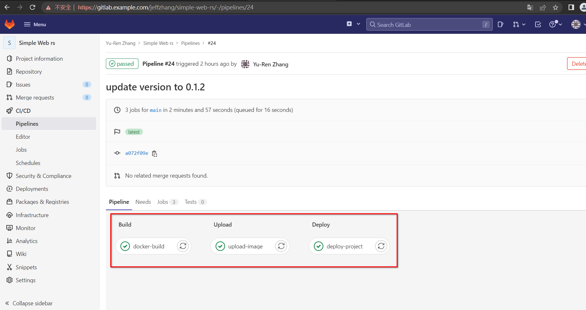
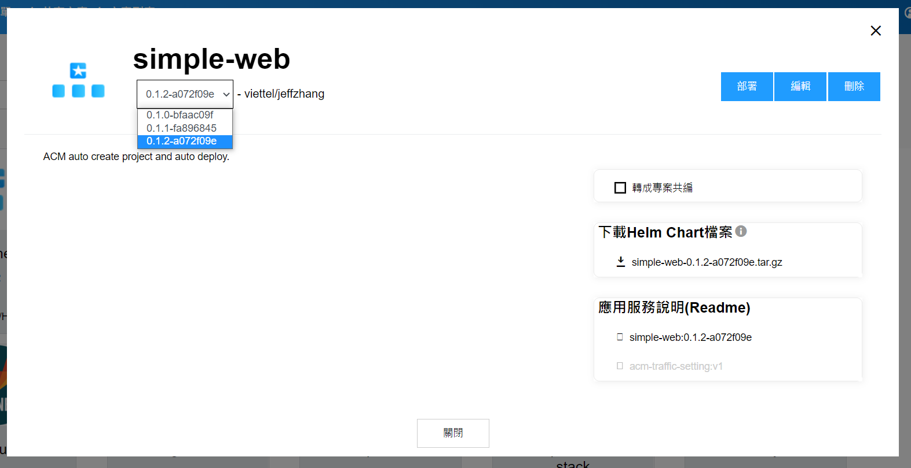
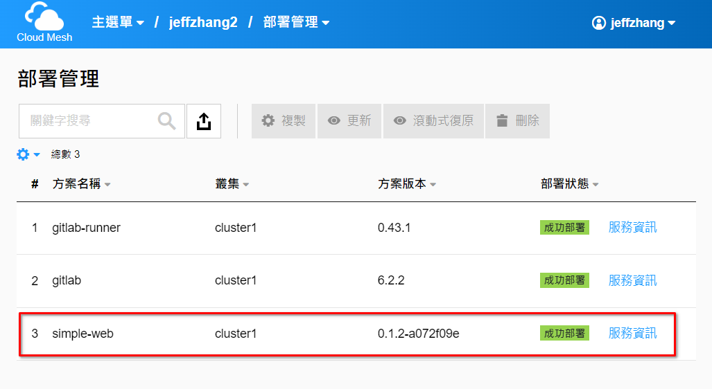
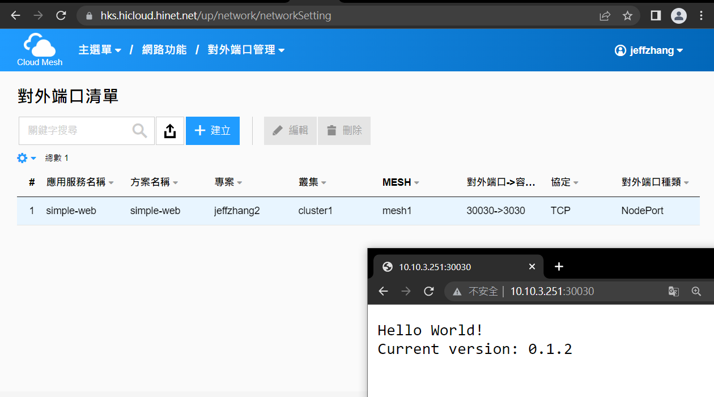
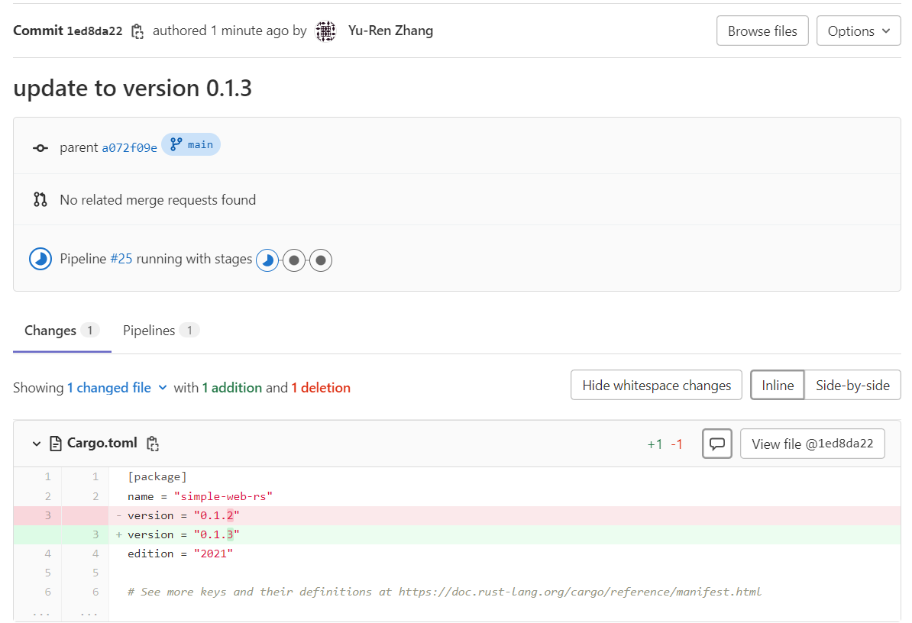
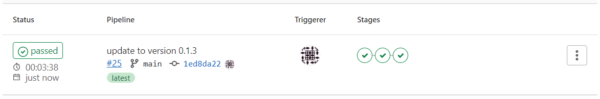
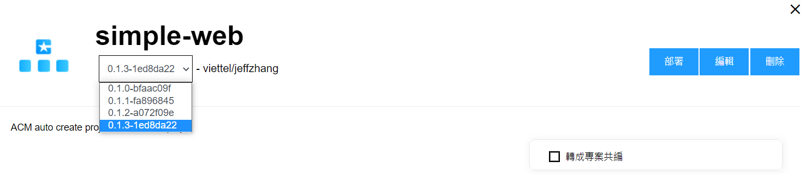
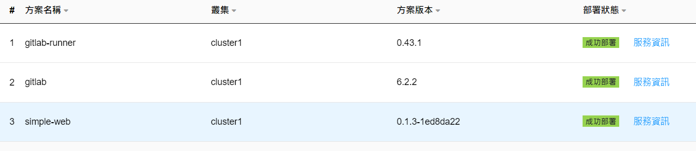
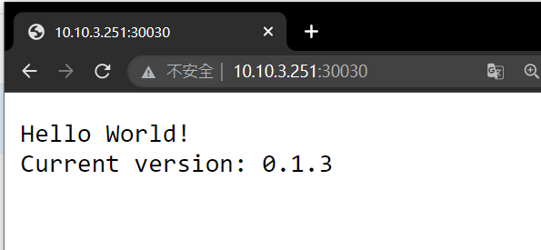

# simple-web-rs

本範例展示Gitlab CI/CD功能與中華電信ACM服務整合。本範例有新commit時，將以Gitlab CI/CD機制將本專案編譯、製作docker映像檔、上傳harbor、並於ACM更新方案、部署方案。

## ACM部署整合說明

注意事項：

- 範例使用的Gitlab是安裝在ACM內部的self-managed版本。
- 此範例若上傳在gitlab.com不會運作，因ACM API服務封閉無法從Internet存取。

使用Gitlab的CI/CD工具，此處將CI/CD分為三個工作：

- Build: 
  - 將原始碼編譯並打包成Docker image並上傳到Gitlab內建的container registry
  - 在統一環境建置原始碼，不受個人環境影響
- Upload:
  - 將映像檔複製，上傳一份到ACM的Harbor
- Deploy:
  - 呼叫ACM的API
  - 在ACM自動建立新版本專案，並部署或更新到叢集。

在CI/CD腳本執行後，會在ACM自動建立的方案。

在建立方案後，會自動部署到指定叢集。

並自動建立對外服務

當程式碼上傳並更新之後，會馬上觸發CI/CD的pipeline。

當pipeline全部pass之後，新方案會建立，佈署。

能看到新版本的程式已經上線運作

